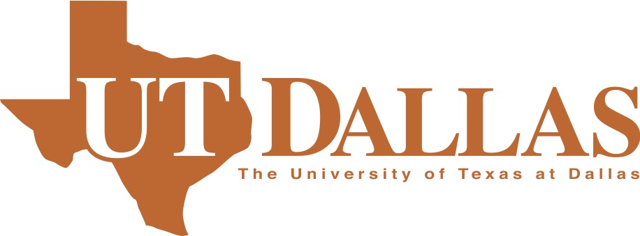

---
---

#### Welcome to the Aging Well Lab at UT Dallas. Our research is dedicated to using basic and translational scientific research studies to promote health and wellbeing across adulthood. We use a variety of behavioral, modeling and neuroimaging techniques to better understand how the mind and the brain change as people get older.

***
#### Opening Fall 2019 in the Center for Vital Longevity

