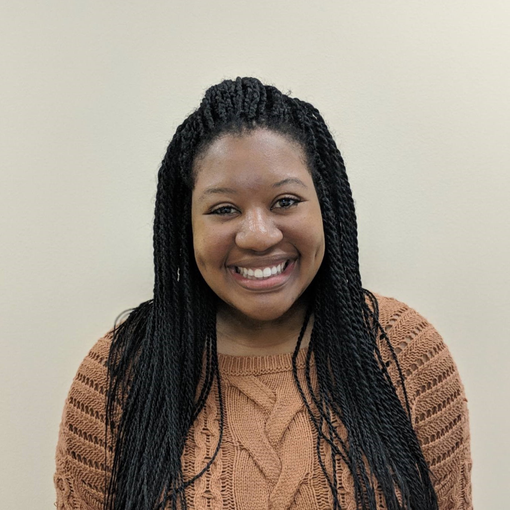

---
---

***

### Lab Director

#### Kendra Seaman
Kendra completed her BA in psychology and biology at the [University of Kansas](https://ku.edu) before joining [Teach For America](https://www.teachforamerica.org). After teaching in Oakland, CA and Washington, DC, she completed a Master's and PhD at [The Catholic University of America](https://www.catholic.edu). She completed a postdoc in the [Motivated Cognition and Aging Brain Lab](https://mcablab.science) with Gregory Samanez-Larkin (at Yale and Duke Universities) before joining the faculty at [UT Dallas](https://www.utdallas.edu).

Kendra's CV is available [ here ](files/KendraSeamanCV4Web.pdf)

***

### Lab Manager

#### Shelby Leverett

Shelby graduated from Duke University with a BS in psychology. After graduation, she spent two years working as a research assistant for the Children’s Learning Institute at UTHealth. She has just completed her Master’s in Neuroscience and Cognition from UTDallas, while working under Dr. Kristen Kennedy in the KNAC lab. She hopes to pursue a PhD in Clinical Neuropsychology, and is very excited to be the lab manager of the Aging Well Lab.

### Collaborators

* [Gregory Samanez-Larkin (Duke)](https://mcablab.science)
* [Brittany Cassidy (UNC-G)](https://psy.uncg.edu/people/cassidy/)
* Jessica Cooper (Emory)

